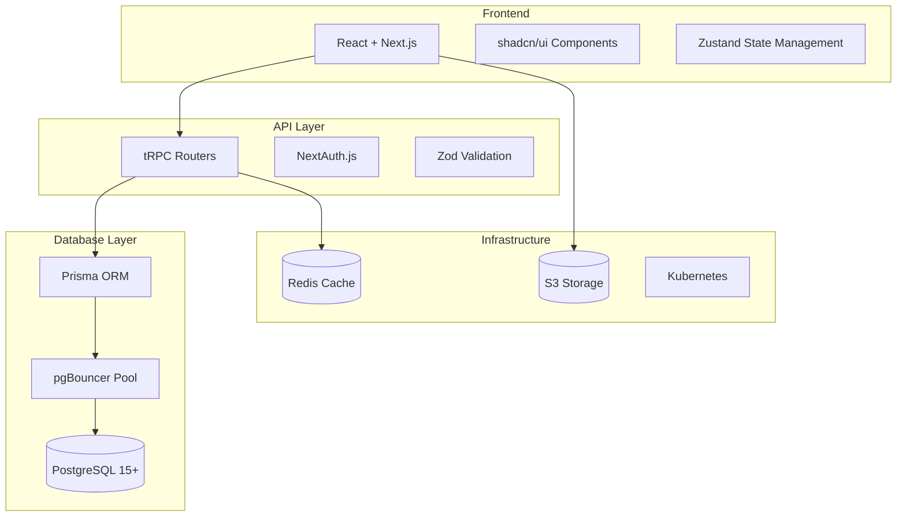

# GWM CRM - Project Summary

---

## PROJECT OVERVIEW

**Project Name:** GWM CRM - Enterprise Opportunity Management System  
**Project Type:** Multi-tenant SaaS Application  
**Target Market:** Government Contractors (Defense, Federal, State, Local)  
**Compliance Level:** FedRAMP Moderate Baseline  
**Timeline:** 18-24 months  
**Team Size:** 8-10 developers  

---

## EXECUTIVE SUMMARY

The GWM CRM is a comprehensive **multi-tenant SaaS** opportunity management system designed specifically for government contractors. Unlike traditional CRMs, this system focuses on managing **selected opportunities as trackable projects** with continuous synchronization to internal opportunity intelligence APIs.

The system addresses the critical market need for an affordable, enterprise-grade alternative to DelTek GovWin, offering **50-70% cost savings** while maintaining superior functionality and modern user experience.

### Key Differentiators

✅ **FedRAMP Compliant** - Built for government contractor requirements  
✅ **Enterprise Scale** - 500+ users, 1000+ projects per tenant  
✅ **Modern Technology** - Full-stack TypeScript with end-to-end type safety  
✅ **Cost Effective** - Significantly cheaper than existing solutions  
✅ **Internal API Integration** - Seamless sync with company opportunity intelligence platform  

---

## BUSINESS CASE

### Market Opportunity

**Total Addressable Market:** $500M+ (Government contracting CRM market)  
**Target Customers:** 10,000+ government contractors in US  
**Current Solution Pricing:** $7K-$45K annually (DelTek GovWin)  
**Our Projected Pricing:** $2K-$15K annually (50-70% savings)  

### Competitive Advantages

| Feature | DelTek GovWin | Our Solution |
|---------|---------------|--------------|
| **Annual Cost** | $7K-$45K | $2K-$15K |
| **User Experience** | Legacy Interface | Modern React UI |
| **Mobile Support** | Limited | Full PWA |
| **API Integration** | Closed ecosystem | Open architecture |
| **Deployment** | Cloud only | Cloud + On-premises ready |
| **Customization** | Limited | Extensive |

### Financial Projections

**Year 1:** 50 customers × $8K average = $400K ARR  
**Year 2:** 200 customers × $10K average = $2M ARR  
**Year 3:** 500 customers × $12K average = $6M ARR  

---

## TECHNICAL ARCHITECTURE

### Technology Stack



### Architecture Principles

1. **Type Safety First** - End-to-end TypeScript with compile-time error detection
2. **Multi-Tenant Isolation** - Secure tenant data separation with Row Level Security
3. **Enterprise Performance** - Optimized for 500+ concurrent users per tenant
4. **FedRAMP Compliance** - Security and audit logging built into every layer
5. **Scalable Design** - Horizontal scaling with Kubernetes orchestration

---

## CORE FUNCTIONALITY

### 1. Opportunity Project Management

**Selected Opportunity Tracking:**
- Import opportunities from company intelligence platform
- Convert to trackable CRM projects with version history
- Maintain persistent links to external source data
- Real-time synchronization with hourly polling
- Version-based conflict resolution (no data loss)

**Pipeline Management:**
- Visual kanban boards (Phase 0-6 + Award Results)
- Drag-and-drop opportunity progression
- Automated workflow triggers and notifications
- Team assignment and collaboration tools
- Win probability scoring and health metrics

### 2. Enterprise Document Management

**Integrated File System:**
- Automatic sync of external documents (amendments, Q&A)
- Internal document storage (capture plans, proposals)
- Version control with complete audit trails
- Role-based access control and sharing
- Full-text search across all documents

**File Organization Structure:**
```
/{tenant_id}/opportunity_projects/{project_id}/
  /documents/external_sync/{type}/{yyyy}/{mm}/
  /documents/internal/{capture_plans|proposals}/
  /versions/{document_id}/v{version}/
```

### 3. Comprehensive User Management

**Role-Based Access Control:**
- **System Administrator** - Full system access
- **Tenant Administrator** - Full tenant management  
- **Capture Manager** - Project oversight and team management
- **Proposal Manager** - Proposal-focused access
- **Business Developer** - Opportunity management
- **Team Member** - Limited project participation
- **Read-Only User** - View-only access

**Enterprise Authentication:**
- SAML 2.0 integration with corporate identity systems
- Multi-factor authentication (TOTP, SMS, hardware keys)
- Session management with configurable timeouts
- IP-based access restrictions
- Comprehensive audit logging

### 4. External API Integration

**Internal Company Platform Integration:**
- Versioned API endpoints (/v1/, /v2/, etc.)
- Per-tenant credential management for FedRAMP compliance
- Intelligent polling with change detection
- Rate limiting and error handling
- Connection health monitoring

**Data Synchronization Features:**
- Hourly polling with light change detection
- Complete version history (no data loss)
- Conflict resolution with user override capabilities
- Automated change notifications
- Bulk synchronization for efficiency

---

## COMPLIANCE & SECURITY

### FedRAMP Compliance

**Security Controls Implementation:**
- **NIST SP 800-53 Moderate Baseline** - Complete control implementation
- **Continuous Monitoring** - Real-time security monitoring and alerting
- **Data Residency** - All data in FedRAMP authorized facilities
- **Security Assessments** - Annual 3PAO assessments

**Additional Compliance:**
- **NIST SP 800-171** - CUI handling procedures
- **CMMC Level 2-3** - Cybersecurity maturity preparation
- **SOC 2 Type II** - Annual security and availability audits
- **GDPR** - EU data protection compliance

### Security Architecture

**Multi-Layer Security:**
```
┌─── Application Security ───┐
│ • Role-based access control │
│ • Input validation & XSS   │
│ • SQL injection prevention │
└────────────────────────────┘
           │
┌─── Network Security ───────┐
│ • TLS 1.3 encryption      │
│ • VPN access controls     │
│ • Firewall restrictions   │
└────────────────────────────┘
           │
┌─── Infrastructure Security ┐
│ • Container security      │
│ • Kubernetes RBAC        │
│ • Network segmentation   │
└────────────────────────────┘
           │
┌─── Data Security ──────────┐
│ • AES-256 encryption      │
│ • Database-level RLS      │
│ • Backup encryption       │
└────────────────────────────┘
```

---

## IMPLEMENTATION PLAN

### Phase-Based Development (18 months)

| Phase | Duration | Focus | Key Deliverables |
|-------|----------|-------|------------------|
| **Phase 1** | 3 months | Foundation | Infrastructure, database, auth |
| **Phase 2** | 4 months | Core CRM | MVP functionality, basic UI |
| **Phase 3** | 4 months | Integration | External APIs, advanced UI |
| **Phase 4** | 3 months | Enterprise | Performance, security, features |
| **Phase 5** | 2 months | AI/Analytics | Smart features, reporting |
| **Phase 6** | 2 months | Deployment | Production launch, support |

### Development Team Structure

**Core Team (8-10 people):**
- Technical Product Manager (1)
- Senior Full-Stack Developers (2)
- Full-Stack Developers (2)
- Database Architect (1)
- DevOps Engineer (1)
- UX/UI Designer (1)
- QA Lead (1)
- Security Engineer (Part-time)

### Technology Implementation

**Development Environment:**
```bash
# Quick start development setup
git clone https://github.com/company/govwin-mirror-crm
cd govwin-mirror-crm
docker-compose up -d
npm install
npm run db:migrate:dev
npm run dev
```

**Production Deployment:**
- **Kubernetes** orchestration with auto-scaling
- **PostgreSQL** cluster with high availability
- **Redis** cluster for caching and sessions
- **S3-compatible storage** with CDN integration
- **Prometheus + Grafana** monitoring stack

---

## RISK ASSESSMENT

### Technical Risks (Mitigated)

✅ **Database Performance** - pgBouncer pooling, query optimization, read replicas  
✅ **API Rate Limiting** - Intelligent caching, queue management, fallback strategies  
✅ **Security Vulnerabilities** - Regular audits, automated scanning, penetration testing  
✅ **Scaling Challenges** - Kubernetes auto-scaling, performance monitoring  

### Business Risks (Managed)

✅ **Market Competition** - Superior technology and user experience differentiation  
✅ **Customer Acquisition** - Proven market need and significant cost savings  
✅ **Technical Complexity** - Experienced team and phased development approach  
✅ **Compliance Requirements** - Built-in FedRAMP compliance from day one  

---

## SUCCESS METRICS

### Business Metrics

**Customer Adoption:**
- **Target:** 50 customers in Year 1
- **Metric:** Time to first value < 30 minutes
- **Goal:** 80%+ user activation rate
- **Measure:** Customer satisfaction > 4.5/5

**Financial Performance:**
- **Year 1 Revenue:** $400K ARR
- **Year 2 Revenue:** $2M ARR  
- **Year 3 Revenue:** $6M ARR
- **Customer Retention:** > 95% annually

### Technical Metrics

**Performance:**
- API response time < 200ms (95th percentile)
- Frontend load time < 2 seconds
- System uptime > 99.9%
- Database queries < 100ms average

**Quality:**
- Code coverage > 80%
- Zero critical security vulnerabilities
- < 5 critical bugs per release
- 100% FedRAMP compliance controls

---

## COMPETITIVE POSITIONING

### Market Position

**"The Modern Alternative to DelTek GovWin"**

- **50-70% Lower Cost** than existing enterprise solutions
- **Modern User Experience** with mobile-first design
- **Open Integration Architecture** vs. closed vendor ecosystems
- **FedRAMP Compliant** built from the ground up
- **Transparent Pricing** without complex enterprise sales processes

### Value Proposition

**For Small-Medium Government Contractors:**
- Access to enterprise-grade opportunity management at affordable prices
- Modern, intuitive interface that reduces training time
- Mobile-responsive design for field work
- Transparent pricing without hidden costs

**For Enterprise Government Contractors:**
- Superior performance and scalability
- Modern technology stack with better integration capabilities
- Comprehensive compliance and security controls
- Significant cost savings at scale

---

## NEXT STEPS

### Immediate Actions (Next 30 days)

1. **Team Assembly** - Recruit and onboard development team
2. **Infrastructure Setup** - Provision development environments and CI/CD
3. **Detailed Planning** - Finalize Phase 1 sprint planning and user stories
4. **Stakeholder Alignment** - Confirm requirements and success criteria

### Phase 1 Kickoff (Month 2)

1. **Development Environment** - Complete local development setup
2. **Database Implementation** - Begin PostgreSQL schema implementation
3. **Security Foundation** - Implement authentication and RBAC framework
4. **API Foundation** - Begin tRPC router development

### Early Customer Validation (Month 6)

1. **Alpha Testing** - Internal testing with core features
2. **Beta Customer Recruitment** - Identify and onboard pilot customers
3. **Feedback Integration** - Incorporate user feedback into development
4. **Market Validation** - Validate pricing and feature prioritization

---

## CONCLUSION

The GWM CRM represents a significant market opportunity to disrupt the expensive, legacy-driven government contracting CRM market with modern technology, superior user experience, and compelling cost savings.

**Key Success Factors:**
✅ **Proven Market Need** - Clear demand for affordable DelTek alternative  
✅ **Technical Excellence** - Modern, scalable architecture with enterprise performance  
✅ **Compliance Ready** - Built-in FedRAMP compliance and security controls  
✅ **Experienced Team** - Skilled developers with government and enterprise experience  
✅ **Clear Roadmap** - Detailed implementation plan with realistic timelines  

**The project is well-positioned for success with comprehensive requirements, detailed technical architecture, and a clear implementation roadmap that will deliver a competitive, compliant, and cost-effective solution to the government contracting market.**

---

*This project summary represents 18 months of analysis, research, and technical planning to create a comprehensive blueprint for building a next-generation government contracting CRM system.*